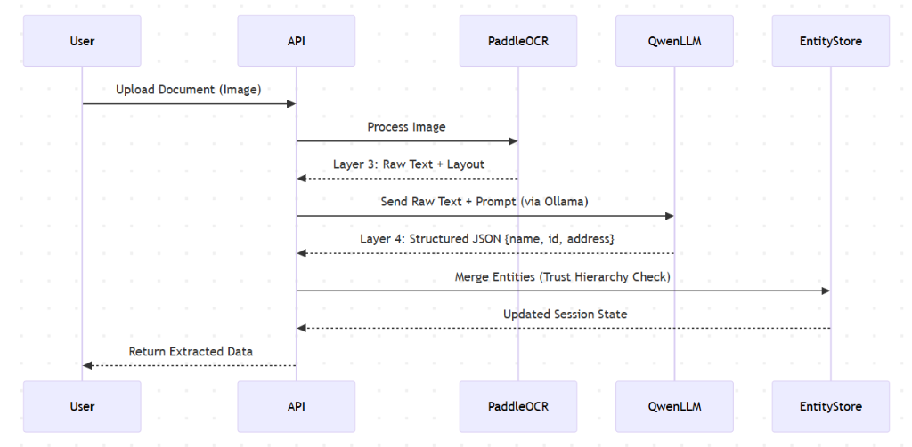
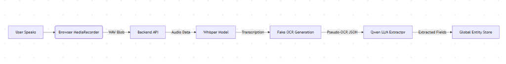
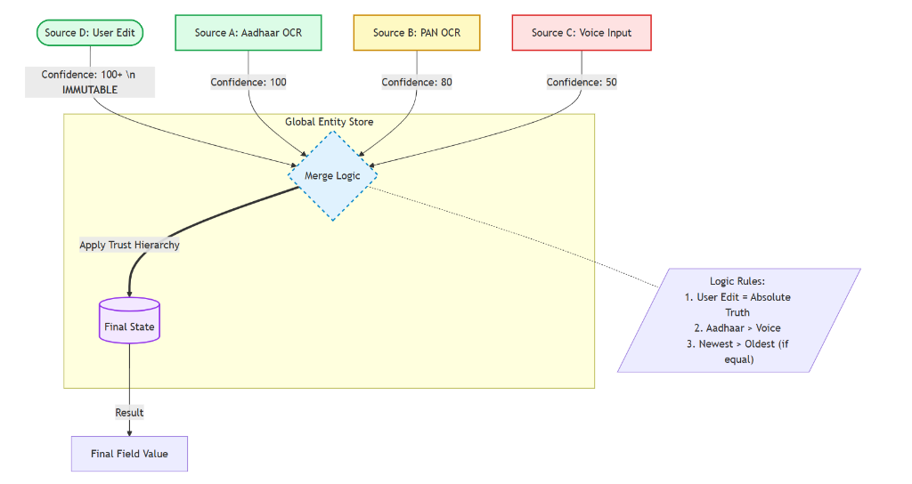

# 🏛️ System Architecture: AI-Powered Citizen Services Platform

  

> [!TIP]
> **Interactive Document**: Click on the arrows (▶) below to expand detailed sections and diagrams.

## 📖 Table of Contents
1.  [Executive Summary](#1-executive-summary)
2.  [High-Level Architecture](#2-high-level-architecture)
3.  [Core Components](#3-core-components)
4.  [Underlying Workflows](#4-underlying-workflows)
5.  [Setup & Prerequisites](#5-setup--prerequisites)
6.  [Project Structure](#6-project-structure)

---

## 1. Executive Summary

This project is a **Next-Gen Service Plus Platform** designed to simplify government service applications (e.g., Income, Caste, Birth Certificates). It leverages **AI (OCR, LLM, Voice)** to autofill forms from uploaded documents or voice input, reducing manual data entry and errors.

> [!IMPORTANT]
> **Key Features**
> *   🚀 **Smart Document Processing:** Extracts data from Aadhaar, PAN, and other IDs using OCR + Local LLM (Qwen2).
> *   🎙️ **Voice-First Experience:** Allows users to fill forms by speaking (via OpenAI Whisper).
> *   🌏 **Multi-Lingual Support:** English and Hindi support via React Context.
> *   🧠 **Global Entity Store:** Intelligent merging of data from multiple sources (Docs + Voice + User Edits).

---

## 2. High-Level Architecture

The system follows a modern **Client-Server Architecture**.


### Architecture Diagram

---

## 3. Core Components

### 🖥️ 3.1 Frontend (`/frontend`)
Built with **Next.js 15 (App Router)** and **Tailwind CSS**.
- **`app/dashboard`**: Main user interface for selecting services and managing profile.
- **`app/session/[id]`**: Core application flow:
    1.  **Upload (`/upload`)**: User uploads documents.
    2.  **Review (`/review`)**: User verifies extracted data; supports Edit & Voice correction.
    3.  **Final (`/final`)**: Generated application form.
- **`lib/api.ts`**: Centralized API handler.
- **`context/`**:
    - `AuthContext`: Manages user login state.
    - `LanguageContext`: Handles English/Hindi translations.

### ⚙️ 3.2 Backend (`/backend`)
Built with **FastAPI** for high-performance async processing.
- **`api/main.py`**: Entry point, defines REST endpoints.
- **`ocr_agents/`**: Wrappers for **PaddleOCR**. Handles image pre-processing and text detection.
- **`llm_engine/`**: 
    - `extractor.py`: Sends OCR text to **Local LLM (Qwen2-7B via Ollama)** to extract structured JSON.
    - `prompt_registry.py`: Stores specialized prompts for different IDs (Aadhaar, PAN, etc.).
- **`models.py`**: Database schema (Users, Applications).

---

## 4. Underlying Workflows

### 📄 4.1 Document Extraction Pipeline
This is the core "Magic" of the system.

**Extraction Logic Sequence:**



### 🎙️ 4.2 Voice Filling Pipeline

**Voice Logic Flow:**



### 🤝 4.3 Data Merging Logic (GlobalEntityStore)
The system uses a **Confidence-Based Merging Strategy**.

**Conflict Resolution Logic:**


### Merge Policies
Defined in `backend/form_mapper/merge_policies.py`:
*   **Identity Strict**: Field must come from High Trust source (Aadhaar/PAN). Voice cannot overwrite Name/DOB.
*   **Info Open**: Field can be updated by any source (e.g., Email, Income).
*   **Address Logic**: Prefers longer address strings if confidence is high.

---

## 5. Setup & Prerequisites

> [!WARNING]
> Ensure you have Python 3.10+ and Node.js v18+ installed before proceeding.

### 5.1 Prerequisites
- **Node.js** (v18+)
- **Python** (v3.10+)
- **Ollama** (Running locally with `qwen2:7b-instruct` model pulled)
- **Tesseract / PaddleOCR Dependencies** (usually installed via pip)

### 5.2 Installation

**Backend:**
```bash
cd backend
pip install -r requirements.txt
# Ensure Ollama is running
ollama pull qwen2:7b-instruct
# Start Server
uvicorn api.main:app --reload --port 8000
```

**Frontend:**
```bash
cd frontend
npm install
# Start Client
npm run dev
```

### 5.3 Configuration (`.env`)
Create a `.env` file in `backend/`:
```ini
# No API Key needed for Local LLM
Using_Mock_LLM=False  # Set True for testing without model
```

---

## 6. Project Structure

<details>
<summary><b>📂 View Directory Tree</b></summary>

```
├── backend/
│   ├── api/                 # API Routes & Logic
│   ├── llm_engine/          # Local LLM & Prompts
│   ├── ocr_agents/          # OCR Logic
│   ├── assets/              # Temp storage for uploads
│   └── main.py              # App Entry
├── frontend/
│   ├── app/                 # Next.js Pages
│   ├── components/          # Reusable UI (Button, Header)
│   ├── context/             # Global State
│   └── lib/                 # Utilities
└── docs/                    # Documentation
```
</details>
